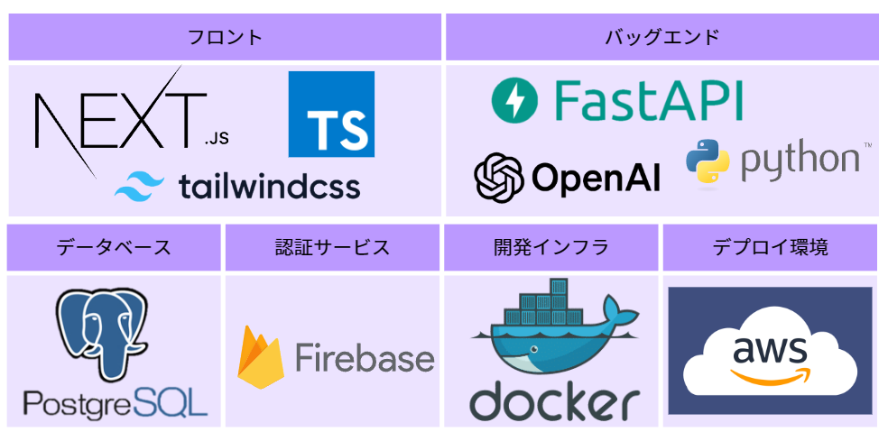
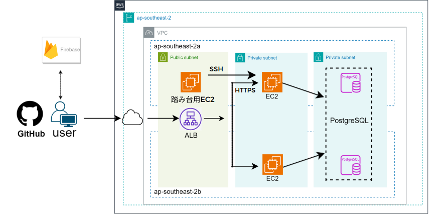

# SkillNavigator

個別最適化された学習計画立案アプリケーション


## 開発背景

私たちがプログラミング学習を進めていく中で、レベルに応じた計画を上手く立案することができない課題に直面しました。その課題を解決するために、個人に合った計画を自動で立案してくれるアプリケーションを開発しました。
さらに本アプリケーションを活用することで、計画立案する負担が軽減されより学習に集中できるようになります。

＊プログラミング学習を提供するMs.Engineerの基礎学習プログラムを念頭においたアプリケーションとなっております。

## 機能紹介
・新規登録機能　<br>
　　グーグルアカウントで認証<br>
・ユーザー設定機能 <br>
　　ユーザーがプログラミング学習歴や曜日ごとの学習可能時間を設定<br>
・計画立案機能　<br>
　　LLMがユーザー設定機能で入力した個人の情報とプログラムの学習所要時間を組み合わせて個人にカスタマイズされた学習計画を立案<br>
・学習記録機能<br>
　　ユーザーが学習した内容と学習時間を記録し進捗を管理<br>

　　　
## システム構成




## 使用技術


<br><br>
NEXT.js: 14.0.4<br>
TypeScript: 5<br>
Tailwind CSS: 3.3.0<br>
Firebase: 10.7.1<br>
FastAPI: 0.105.0<br>
Python: 3.11<br>
langchain: 0.0.352<br>
openai: 1.6.1<br>
postgres: 15.5<br>
Docker: 24.0.6<br>
AWS EC2, ALB<br>


## 使い方
### リポジトリからクローン

```
git clone [リポジトリのURL]
cd [クローンしたディレクトリ]

```

### Next.js
```
cd client  # Next.js アプリケーションが含まれるディレクトリに移動
npm install
```


### env ファイルの設定
.env.example のテンプレートを使用してください

### コンテナ起動
```
docker　compose up -d --build
```

## デモ動画

<video src="%E7%99%BA%E8%A1%A8%E5%8B%95%E7%94%BB/SkillNavigator%20%E7%99%BA%E8%A1%A8%E8%B3%87%E6%96%99%20.mp4" controls title="Title"></video>